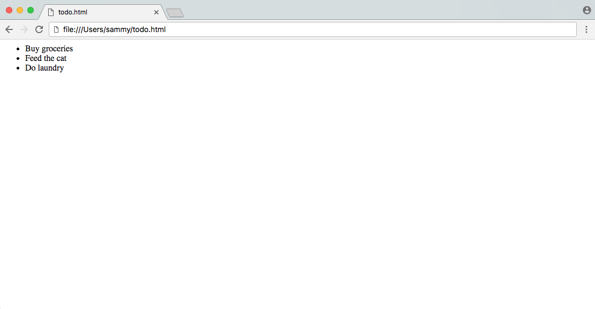
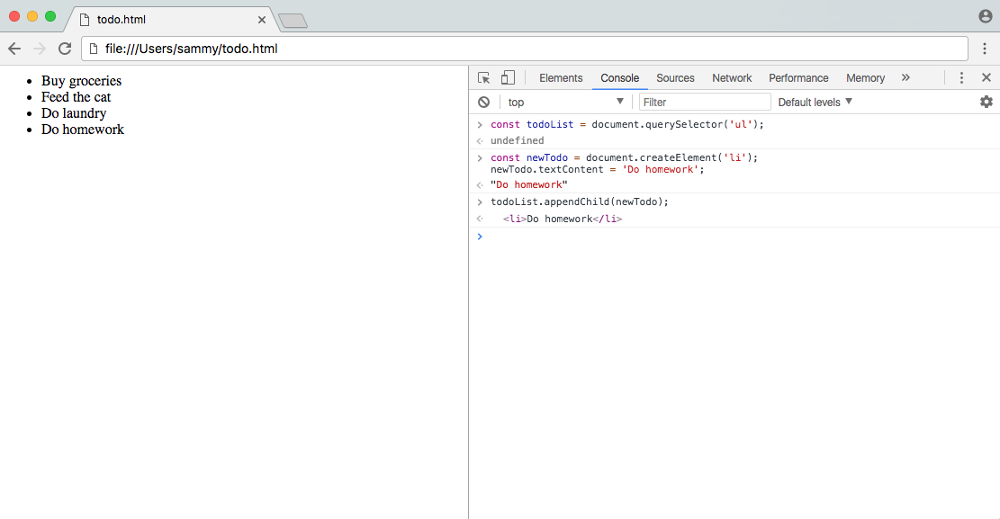
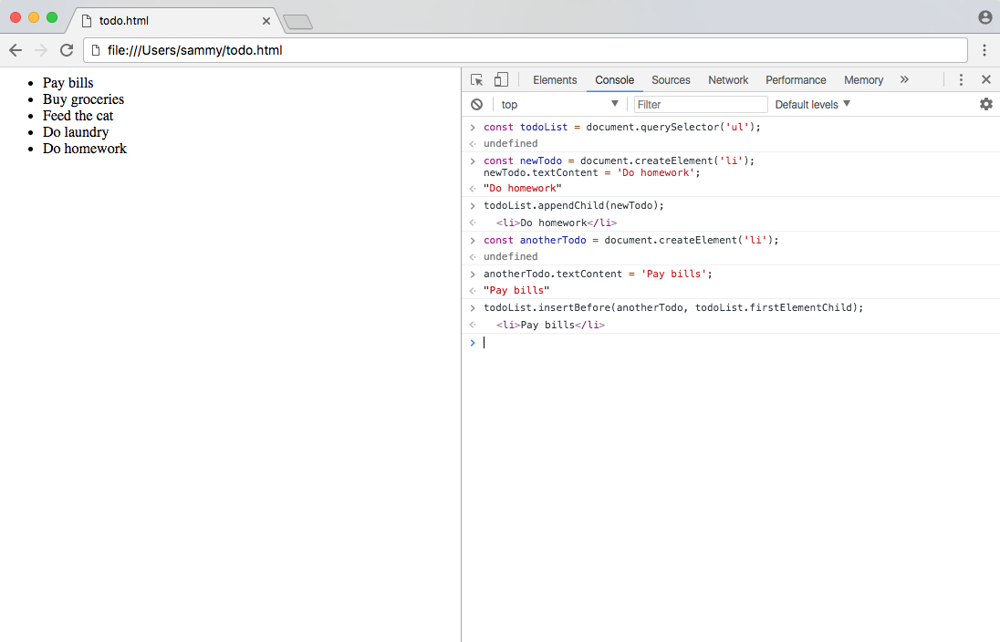
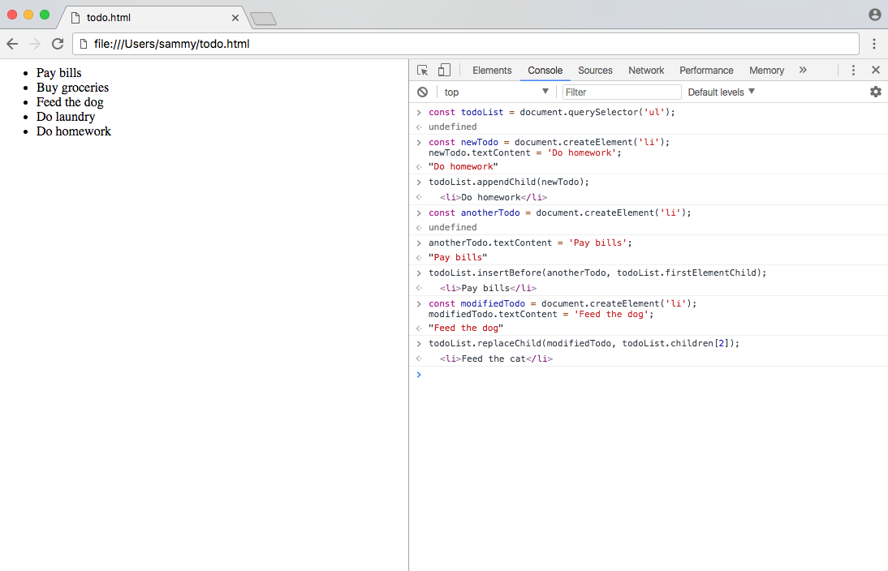
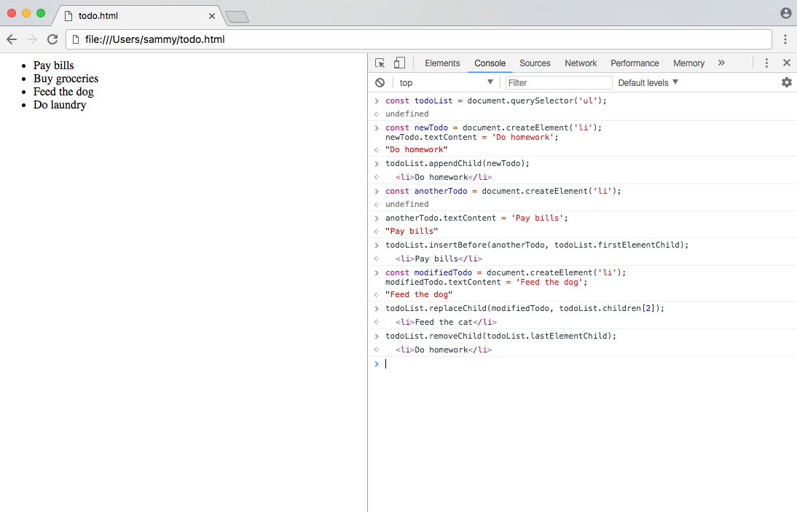
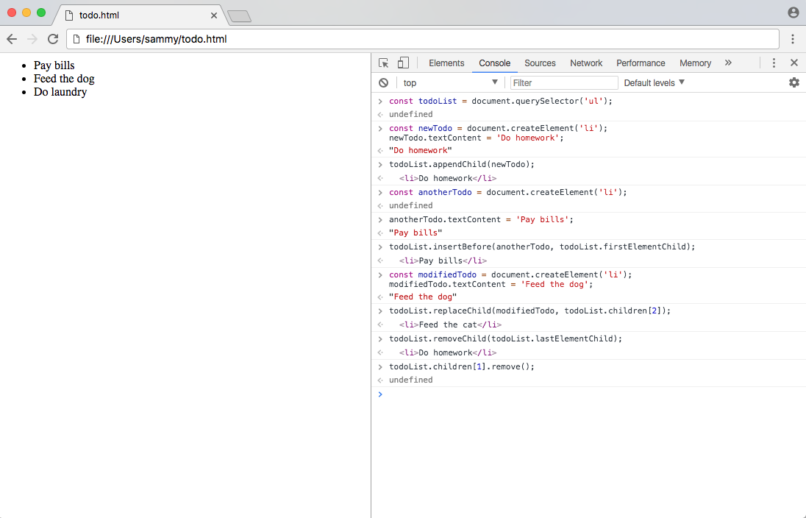

_This post was originally written for [DigitalOcean](https://www.digitalocean.com/community/tutorials/how-to-make-changes-to-the-dom)_.

In the previous two installments of the Understanding the DOM series, we learned [How to Access Elements in the DOM](/how-to-access-elements-in-the-dom) and [How to Traverse the DOM](/how-to-traverse-the-dom). Using this knowledge, a developer can use classes, tags, ids, and selectors to find any node in the DOM, and use parent, child, and sibling properties to find relative nodes.

The next step in understanding the DOM is to learn how to add, change, replace, and remove nodes. A to-do list application is one practical example of a JavaScript program in which you would need to be able to create, modify, and remove elements in the DOM.

In this article, we will learn how to create new nodes and insert them into the DOM, replace existing nodes, and remove nodes.

## Creating New Nodes

In a static website, elements are added to the page by directly writing HTML in an `.html` file. In a dynamic web app, elements and text are often added with JavaScript. The `createElement()` and `createTextNode()` methods are used to create new nodes in the DOM.

| Property/Method                                                                                | Description                                    |
| ---------------------------------------------------------------------------------------------- | ---------------------------------------------- |
| [`createElement()`](https://developer.mozilla.org/en-US/docs/Web/API/Document/createElement)   | Create a new element node                      |
| [`createTextNode()`](https://developer.mozilla.org/en-US/docs/Web/API/Document/createTextNode) | Create a new text node                         |
| [`node.textContent`](https://developer.mozilla.org/en-US/docs/Web/API/Node/textContent)        | Get or set the text content of an element node |
| [`node.innerHTML`](https://developer.mozilla.org/en-US/docs/Web/API/Element/innerHTML)         | Get or set the HTML content of an element      |

Open up a new basic `index.html` file to work with.

```html
<!DOCTYPE html>
<html lang="en">
  <head>
    <title>Learning the DOM</title>
  </head>

  <body>
    <h1>Document Object Model</h1>
  </body>
</html>
```

We will use `createElement()` on the `document` object to create a new `p` element.

```js
const paragraph = document.createElement('p')
```

We've created a new `p` element, which we can test out in the _Console_.

```terminal
console.log(paragraph);
```

<div class="filename">Console</div>

```html
<p></p>
```

The `paragraph` variable outputs an empty `p` element, which is not very useful without any text. In order to add text to the element, we'll set the `textContent` property.

```js
paragraph.textContent = "I'm a brand new paragraph."
```

```terminal
console.log(paragraph);
```

<div class="filename">Console</div>

```html
<p>I'm a brand new paragraph.</p>
```

A combination of `createElement()` and `textContent` creates a complete element node.

An alternate method of setting the content of the element is with the `innerHTML` property, which allows you to add HTML as well as text to an element.

```js
paragraph.innerHTML = "I'm a paragraph with <strong>bold</strong> text."
```

While this will work and is a common method of adding content to an element, there is a possible [cross-site scripting (XSS)](https://developer.mozilla.org/en-US/docs/Web/API/Element/innerHTML#Security_considerations) risk associated with using the `innerHTML` method, as inline JavaScript can be added to an element. Therefore, it is recommended to use `textContent` instead, which will strip out HTML tags.

It is also possible to create a text node with the `createTextNode()` method.

```js
const text = document.createTextNode("I'm a new text node.")
```

```terminal
console.log(text);
```

<div class="filename">Console</div>

```js
"I'm a new text node."
```

With these methods, we've created new elements and text nodes, but they are not visible on the front end of a website until they've been inserted into the document.

## Inserting Nodes into the DOM

In order to see the new text nodes and elements we create on the front end, we will need to insert them into the `document`. `appendChild()` and `insertBefore()` are used to add items to the beginning, middle, or end of a parent element, and `replaceChild()` is used to replace an old node with a new node.

| Property/Method                                                                             | Description                                                         |
| ------------------------------------------------------------------------------------------- | ------------------------------------------------------------------- |
| [`node.appendChild()`](https://developer.mozilla.org/en-US/docs/Web/API/Node/appendChild)   | Add a node as the last child of a parent element                    |
| [`node.insertBefore()`](https://developer.mozilla.org/en-US/docs/Web/API/Node/insertBefore) | Insert a node into the parent element before specified sibling node |
| [`node.replaceChild()`](https://developer.mozilla.org/en-US/docs/Web/API/Node/replaceChild) | Replace an existing node with a new node                            |

Let's create a simple to-do list with HTML.

```html
<ul>
  <li>Buy groceries</li>
  <li>Feed the cat</li>
  <li>Do laundry</li>
</ul>
```

When you load your page in the browser, it will look like this:



In order to add a new item to the end of the to-do list, we have to create the element and add text to it first, as we learned in "Creating New Nodes".

```js
// To-do list ul element
const todoList = document.querySelector('ul')

// Create new to-do
const newTodo = document.createElement('li')
newTodo.textContent = 'Do homework'
```

Now that we have a complete element for our new to-do, we can add it to the end of the list with `appendChild()`.

```js
// Add new todo to the end of the list
todoList.appendChild(newTodo)
```

You can see the new `li` element has been appended to the end of the `ul`.

```html
<ul>
  <li>Buy groceries</li>
  <li>Feed the cat</li>
  <li>Do laundry</li>
  <li>Do homework</li>
</ul>
```



Maybe we have a higher priority to-do, and we want to add it to the beginning of the list. We'll have to create another element, as `createElement()` only creates one element and cannot be reused.

```js
// Create new to-do
const anotherTodo = document.createElement('li')
anotherTodo.textContent = 'Pay bills'
```

We can add it to the beginning of the list using `insertBefore()`. This method takes two arguments - the first is the new child node to be added, and the second is the sibling node that will immediately follow the new node. In other words, you're inserting the new node before the next sibling node.

```js
parentNode.insertBefore(newNode, nextSibling)
```

For our to-do list example, we'll add the new `anotherTodo` element before the first element child of the list, which is currently the `Buy groceries` list item.

```js
// Add new to-do to the beginning of the list
todoList.insertBefore(anotherTodo, todoList.firstElementChild)
```

```html
<ul>
  <li>Pay bills</li>
  <li>Buy groceries</li>
  <li>Feed the cat</li>
  <li>Do laundry</li>
  <li>Do homework</li>
</ul>
```



The new node has successfully been added at the beginning of the list. Now we know how to add a node to a parent element. The next thing we might want to do is replace an existing node with a new node.

We'll modify an existing to-do to demonstrate how to replace a node. The first step of creating a new element remains the same.

```js
const modifiedTodo = document.createElement('li')
modifiedTodo.textContent = 'Feed the dog'
```

Like `insertBefore()`, `replaceChild()` takes two arguments - the new node, and the node to be replaced.

```js
parentNode.replaceChild(newNode, oldNode)
```

We will replace the third element child of the list with the modified to-do.

```js
// Replace existing to-do with modified to-do
todoList.replaceChild(modifiedTodo, todoList.children[2])
```

```html
<ul>
  <li>Pay bills</li>
  <li>Buy groceries</li>
  <li>Feed the dog</li>
  <li>Do laundry</li>
  <li>Do homework</li>
</ul>
```



With a combination of `appendChild()`, `insertBefore()`, and `replaceChild()`, you can insert nodes and elements anywhere in the DOM.

## Removing Nodes from the DOM

Now we know how to create elements, add them to the DOM, and modify existing elements. The final step is to learn to remove existing nodes from the DOM. Child nodes can be removed from a parent with `removeChild()`, and a node itself can be removed with `remove()`.

| Method                                                                                    | Description       |
| ----------------------------------------------------------------------------------------- | ----------------- |
| [`node.removeChild()`](https://developer.mozilla.org/en-US/docs/Web/API/Node/removeChild) | Remove child node |
| [`node.remove()`](https://developer.mozilla.org/en-US/docs/Web/API/ChildNode/remove)      | Remove node       |

Using the to-do example above, we'll want to delete items after they've been completed. If you completed your homework, you can remove the `Do homework` item, which happens to be the last child of the list, with `removeChild()`.

```js
todoList.removeChild(todoList.lastElementChild)
```

```html
<ul>
  <li>Pay bills</li>
  <li>Buy groceries</li>
  <li>Feed the dog</li>
  <li>Do laundry</li>
</ul>
```



A simpler method could be to remove the node itself, using the `remove()` method directly on the node.

```js
// Remove second element child from todoList
todoList.children[1].remove()
```

```html
<ul>
  <li>Pay bills</li>
  <li>Feed the dog</li>
  <li>Do laundry</li>
</ul>
```



Between `removeChild()` and `remove()`, you can remove any node from the DOM. Another method you might see for removing child elements from the DOM is setting the `innerHTML` property of a parent element to an empty string (`""`). This is not the preferred method, but you might see it.

## Conclusion

In this tutorial, we learned how to use JavaScript to create new nodes and elements and insert them into the DOM, and replace and remove existing nodes and elements.

At this point in the Understanding the DOM series you know how to access any element in the DOM, walk through any node in the DOM, and modify the DOM itself. You can now feel confident in creating basic front-end web apps with JavaScript.
